# Laboratório de Introdução À Engenharia da Computação
#### _PucMinas - São Gabriel_

Uma introduçãao a eletrica, eletrônica e conhecimento do funcionamento de computadores e dispositivos eletrônicos.

Ao longo da disciplina, as praticas realizadas foram através de relatórios onde, o desenvolvimento prático no laboratório, a prática com arduino foi um destaque, utilizando a interface de IDE para o arduino de forma física e pela plataforma virtual denominada TinckerCad.

- [IDE Arduino](https://www.arduino.cc/en/software)
    - _Para usuários Linux, a IDE do Arduino pode ser baixada pela Store do sistema._
- [TinckerCad](https://www.tinkercad.com/)
    - _Necessário criar uma conta para poder desenvolver na plataforma. **Recomendação: _utilizar o LogIn via conta Google(Gmail)_**_

---
## SUMÁRIO
- [NOÇÕES BÁSICAS DE CIRCUITOS ELÉTRICOS SIMPLES](#noções-básicas-de-circuitos-elétricos-simples)
    - [Voltagem ou Tensão](#voltagem-ou-tensão)
    - [Corrente](#corrente)
    - [Resistência](#resistência)
        - [Associação de resistores em série](#associação-de-resistores-em-série)
        - [Associação de resistores em paralelo](#associação-de-resistores-em-paralelo)
        - [Potência Dissipada](#potência-dissipada)

- [TINKERCAD - SIMULADOR DE CIRCUITOS ELETRÔNICOS](#tinkercad---simulador-de-circuitos-eletrônicos)

- [TRABALHANDO COM O TINKERCAD](#trabalhando-com-o-tinkercad)
    - [Protoboard](#protoboard)
        - [Ligação Em Série](#ligação-em-série)
        - [Ligação Em Paralelo](#ligação-em-paralelo)
    - [O Multímetro](#o-multímetro)
        - [O Múltímetro no simulador Tinkercad](#o-múltímetro-no-simulador-tinkercad)
    - [Medições de Tensão (ou voltagem)](#medições-de-tensão-ou-voltagem)
    - [Medições de Corrente](#medições-de-corrente)
    - [Acionamento e cálculo de corrente com Leds](#acionamento-e-cálculo-de-corrente-com-leds)
- [DIVISOR DE TENSÃO](#divisor-de-tensão)

- [UTILIZANDO O TINKERCAD: SIMULANDO CIRCUITOS COM RELÉ](#utilizando-o-tinkercad-simulando-circuitos-com-relé)
    - [Teoria de Funcionamento de um Relé](#teoria-de-funcionamento-de-um-relé)

- [ÁLGEBRA BOOLEANA E CIRCUITOS LÓGICOS](#c3a1lgebra-booleana-e-circuitos-lc3b3gicos-1)
    - [Álgebra de Boole](#álgebra-de-boole)
        - [Tabela da Verdade](#tabela-da-verdade)
        - [Portas Lógicas](#portas-lógicas)
        - [Associações de Portas](#associações-de-portas)
- [SIMULADOR DE CIRCUITOS DIGITAIS LOGISIM](#simulador-de-circuitos-digitais-logisim)

- [Álgebra Booleana e Circuitos Lógicos](#álgebra-booleana-e-circuitos-lógicos)

- [CIRCUITOS INTEGRADOS](#circuitos-integrados)
    - [MONTAGENS DE CIRCUITOS INTEGRADOS](#montagens-de-circuitos-integrados)
        - [Parte 1](#parte-1)
        - [Parte 2](#parte-2)

- [INTRODUÇÃO AO ARDUINO](#introdução-ao-arduino)
    - [Arduino](#arduino)
    - [SHIELDS](#shields)
        - [Arduino + SHIELDS](#arduino--shields)
    - [Sensores](#sensores)
    - [Atuadores](#atuadores)
    - [Projetando Circuitos Com Arduino](#projetando-circuitos-com-arduino)
        - [Montagem de Circuitos Elétricos Com Arduino](#montagem-de-circuitos-elétricos-com-arduino)
        - [Ligando LEDs com Arduino](#ligando-leds)

- [Linguagem de Programação do Arduino](#linguagem-de-programação-do-arduino)

- [TINKERCAD PARA SIMULAR CIRCUITOS COM O ARDUINO](#tinkercad-para-simular-circuitos-com-o-arduino)
    - [LED RGB](#led-rgb)
        - [LED RGB - Entrada de Dados](#led-rgb---entrada-de-dados)
    - [Botões](#botões)
        - [Botões  - Entrada de Dados](#botões---entrada-de-dados)
    - [Comunicação Serial no Arduino](#comunicação-serial-no-arduino)
        - [Comunicação Serial](#comunicação-serial)
    - [Principais Funções:](#principais-funções)
        - [PWM](#pwm)
            - [Controlando Quantidade de Volts](#controlando-quantidade-de-volts)
            - [Controle de Brilho do LED](#controle-de-brilho-do-led)

- [LDR](#ldr)
    - [Medir Luz](#medir-luz)

- [BUZZER](#buzzer)

- [SENSOR ULTRASÔNICO](#sensor-ultrassônico)
    - [Ultrassom na Natureza](#ultrassom-na-natureza)
    - [Adaptações de Ultrassom Feitas Pelo Ser Humano](#adaptações-de-ultrassom-feitas-pelo-ser-humano)
    - [Como Funciona um Ultrassom](#como-funciona-um-ultrassom)
        - [Física Básica](#física-básica)
    - [Funcionamento de um Sensor Ultrassônico](#funcionamento-de-um-sensor-ultrassônico)

- [MEDINDO TEMPERATURA](#medindo-temperatura)
    - [Sensor de Temperatura](#sensor-de-temperatura)

- [MEDINDO UMIDADE DO SOLO](#medindo-umidade-do-solo)
    - [Sensor de Umidade do Solo](#sensor-de-umidade-do-solo)

- [SERVO MOTORES](#servo-motores)

- [Seminário IoT](#seminário-iot)

- [Trabalho Final do Curso Laboratório de Introdução À Engenharia de Computação](#trabalho-final-do-curso-laboratório-de-introdução-à-engenharia-de-computação)

- [Tabela de Comandos - Linguagem Arduino](#tabela-de-comandos---linguagem-arduino)

---

## NOÇÕES BÁSICAS DE CIRCUITOS ELÉTRICOS SIMPLES
**Circuitos eletrônicos** são misturas de diversos componentes individuais que, ao se **unirem**, realizam um função conjunta entre eles. Se analisarmos uma **placa de circuito eletrônico**, podemos observar que ela contém vários *resistores*, *capacitores*, *chips de circuito integrado*, entre vários outros componentes. Unidos, dependendo de como estão interligados, este circuito pode **realizar diversas funções**.

Uma maneira simples de se achar circuitos eletrônicos são em *placas mãe de computadores*, em placas de **componentes eletrônicos** como as de ***celulares***, ***tablets***, ***impressoras***, ***geladeiras modernas***, ***painel eletrônico de carros e motos***, dentre vários outros exemplos.

Porém para que estes circuitos eletrônicos funcionem eles precisam de algo extremamente importante. Assim como os  seres humanos, animais e plantas precisam *respirar*, *inalando* e *exalando* **ar**, os circuitos eletrônicos precisam de **energia elétrica** para funcionarem. Mas qual seria o “*ar*” dos circuitos eletrônicos? Apenas uma ***tomada***? Talvez uma simples ***bateria***? Mas o que a tomada e a bateria tem em comum? 

Tudo que produz, emite, recebe ou consome energia elétrica é alimentado pela **tensão**, também chamada de **voltagem** ou em um vocabulário mais técnico ***Diferença De Potencial***.

Estas medidas, *tensão/voltagem*, *corrente*, *resistência*, entre outras; são valores que precisamos observar quando se trata de *eletrônica* e/ou *circuitos elétricos*.

### Voltagem ou Tensão
Quando ouvimos ou dizemos as palavras **voltagem**, **diferença de potencial entre dois pontos** ou **tensão**, nos referimos ao ***custo em energia***, ou seja, o ***trabalho*** necessário para *mover uma carga unitária de um ponto com um potencial elétrico mais baixo a outro de potencial elétrico mais alto*.

O conceito de ***potencial elétrico*** é muito similar ao conceito de ***potencial gravitacional***. Mover uma
carga de um ponto cujo potencial é menor para outro ponto de potencial maior, é um processo similar a mover uma massa de uma posição a outra. Para mover a massa do chão até um ponto situado sobre uma mesa a **energia potencial** é alterada. Podemos definir como zero de energia potencial o solo, e neste caso estaremos ganhando energia potencial gravitacional. Se definirmos o potencial zero como sendo o nível da mesa, o solo terá um potencial negativo. Mesmo assim, ao movermos a massa no sentido do chão para a mesa, ganhamos energia potencial!

Com o *potencial elétrico* ocorre o mesmo, temos que definir um ponto de referência. As medidas que realizamos, correspondem às **diferenças de potencial elétrico** entre a referência e um outro ponto qualquer do espaço. Costuma-se definir esse ponto de referência como sendo a terra (o solo). A voltagem entre dois pontos, portanto, é a diferença que existe entre os potenciais desses pontos. Fica claro que só há *sentido em definir voltagem **ENTRE DOIS PONTOS***.

O trabalho realizado ao se mover uma carga de *1 coulomb* através de uma ***diferença de potencial*** de *1 volt*, é de *1 joule*. 

A **unidade de medida de diferença de potencial é o volt (V)**, e frequentemente é expressa em múltiplos tais como:
NomeNclatura |       Escala       | Símbolo
------------|--------------------|----------
Quilovolt   | $$1kV = 10^3V$$    | Kv
Milivolt    | $$1mV = 10^-3V$$   | mV
Microvolt   | $$1µV = 10^-6V$$   | µV

Milivolt(mV) | Volt(V)
-------------|----------
1 mV         | 0.001 V
10 mV        | 0.010 V
100 mV       | 0.100 V

**RESUMO Tensão/Voltagem:** Tensão, Voltagem ou Diferença de Potencial é uma magnitude física que impulsiona eletrons ao longo de um circuíto elétrico condutor fechado, que gera o fluxo de corrente elétrica. Tem como unidade de medida o Volt(V).

### Corrente
Representada pelo símbolo **i**, a corrente é o ***fluxo de carga elétrica*** que passa por um determinado ponto. A unidade de medida de corrente é o **ampere** (1A = 1 coulomb/segundo). O ampere, em geral, é uma *grandeza* muito grande para as aplicações do dia-a-dia. Por isso, as correntes são geralmente expressas em: 

Nomeclatura    |        Escala      | Símbolo
---------------|--------------------|----------
Mili-amperes   | $$1mA = 10^-3A$$   | mA
Micro-amperes  | $$1µA = 10^-6A$$   | µA
Nano-amperes   | $$1nA = 10^-9A$$   | nA

Miliampere(mA) | Ampère(A)
---------------|----------
1 mA           | 0.001 A
10 mA          | 0.010 A
100 mA         | 0.100 A

Por convenção, os portadores de corrente elétrica são cargas positivas que fluem de potenciais mais altos para os mais baixos (embora o fluxo de elétrons real seja no sentido contrário).

#### Corrente Contínua
Dá-se contínua devido ao fluxo contínuo de elétrons através de um condutor entre dois pontos de potencial elétrico diferentes.

Na **corrente contínua** as cargas sempre tem um único fluxo, ou seja, seguem uma única direção, mantendo a polaridade constante. Sua forma de onda é uma **reta** partindo do valor de **Tensão** que possuí e tem como símbolo as letras **DC**.

A corrente contínua, em sua maioria é muito utilizada em circuítos de componentes eletrônicos, sejam eles alimentados à pilha, baterias e/ou até mesmo fontes de alimentação fraca com 5V ou 12V.

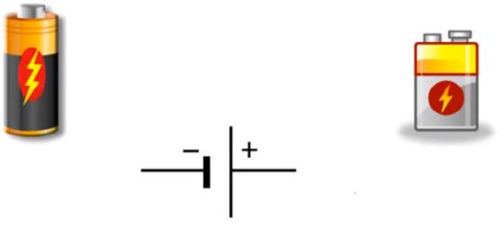

#### Corrente Alternada
Da-se alternada pois a magnitude da onda e sua direção, variam de maneira ciclica. Sua forma de onda é representada por uma **onda senoidal** e tem como símbolo as letras **AC**. Quando esta onda realiza um movimento onde atinge um pico positivo e em seguida um pico negativo, como se formasse a letra "**S**", então obtemos **1 ciclo**.

A corrente altrnada, em sua maioria é a energia elétrica "pura", ou seja, a energia que é transmitida através dos transformadores das companhia elétricas, até o interior de nossas casas e/ou empresas.

**LEI DE OHM:** A corrente(i) que flui através de um fio condutor elétrico é diretamente proporcional à voltagem(V) e inversamente proporcional à resistência(R).

**RESUMO CORRENTE:** É o fluxo de elétrons livres através de um condutor ou semicondutor. Tem como unidade de medida o Ampère(A) e pode variar entre Corrente Contínua ou Corrente Alternada.

### Resistência
Para que haja fluxo de cargas  elétricas  são  necessários  dois  ingredientes  básicos:  ***uma  diferença  de  potencial  e  um  meio  por  onde  as  cargas  elétricas  devem  circular.  Para  uma  dada  voltagem,  o  fluxo  de  cargas  dependerá  da  resistência do meio por onde essas cargas deverão passar***.

Quanto **maior a resistência**, **menor o fluxo de cargas** para uma dada diferença de  potencial.  

Os  materiais  são  classificados,  em  relação  à  passagem  de  corrente elétrica, em três categorias básicas:  
**Isolantes:** que são aqueles que oferecem alta resistência à passagem de cargas elétricas;  
**Condutores:**  que  não oferecem quase nenhuma resistência à passagem de corrente elétrica;  
**Semicondutores:** que se situam entre   os   dois   extremos   mencionados   anteriormente.  

O  símbolo  que  utilizamos  para  indicar  a  resistência  de  um  material é a letra **R** e a ***unidade de resistência elétrica*** é o **ohm (Ω)**. O símbolo para  indicar  uma  resistência  em  um  *circuito  elétrico*  é  mostrado  na  figura abaixo:

  
Representação esquemática de um resistor colocado entre os pontos A e B de um dado circuito.

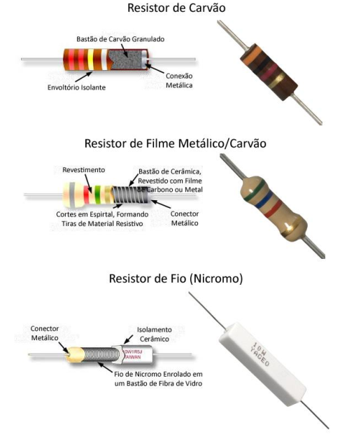

Os resistores podem ser de diferentes tipos e terem diferentes materiais. Cada um possui suas próprias particulares.

As diferenças de potencial são produzidas por **geradores**, que são dispositivos que  realizam  trabalho  de  algum  tipo  sobre  as  **cargas  elétricas**,  levando-as  de  um  potencial  mais  baixo  para  outro  mais  alto.  

Isso é o que ocorre em dispositivos como:
    Origem   | Forma de Geração de Energia
-------------|----------
**Baterias** | *Energia   Eletroquímica*
**Geradores de Usinas Hidrelétricas** | *Energia  potencial  da  água  armazenada  na  represa*
**Células  Solares** | *Conversão Ffotovoltaica da energia dos fótons da luz incidente*
|

A **resistência ***R*** de um material condutor** é definida pela razão entre a **voltagem** ***V*** aplicada aos seus terminais e pela **corrente** ***i*** passando por ele:

`R = V / i`

Esta equação  é  uma  das  representações  da  **Lei  de  Ohm**,  que  é  muito  utilizada.  

Por  essa  equação  vemos  que  no  *SI(Sistema Internacional de Medidas)* a unidade de  **resistência** é definida por: 

`1Ω = 1V / 1 A` 

Na  montagem  de  circuitos  elétricos  e  eletrônicos  dois  tipos  de  associação  de  elementos são muito comuns: **associações em série** e **associações em paralelo**.

#### Associação de resistores em série
Num circuito elétrico os dois **resistores associados em série** (1° Imagem) têm o mesmo efeito de **um único resistor** equivalente de resistência *RS*(2° Imagem).

Nesta imagem temos uma associação de resistores R1 e R2 em série.

A imagem acima também pode ser representada por esta segunda forma, já que estão ligados em série.  
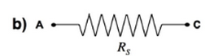

Na associação em série de resistores, a corrente *i1* passando por *R1* e *i2* por *R2* são a mesma corrente *i* passando pela associação: 

` i = i1 = i2`

As voltagens no resistor **R1**,**V1** = *VAB* e no resistor **R2**,**V2** = *VBC* somadas são iguais à voltagem da associação *VAC*:

`VAC = VAB +VBC = V1+V2`

Para a associação em série de resistores(RS) temos:  
`RS = R1 + R2`

Para se sabe quanto cada rsistor possuem na escala de Ohm, existe alguns procedimentos que auxiliam a saber quanto cada resistor mede em Ohm.

Faixa do Resistor | Significado
------------------|---------------
Primeira Faixa(a) | Primeiro Número
Segunda Faixa(b)  | Segundo Número
Terceira Faixa(c) | Multiplicador
Quarta Faixa(d)   | Tolerância

Sabendo o que cada faixa representa e tendo como referencia as letras de cada caixa, podemos utilizar a seguinte formula:

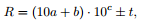

Para saber os valores de cada faixa usamos a seguinte tabela:

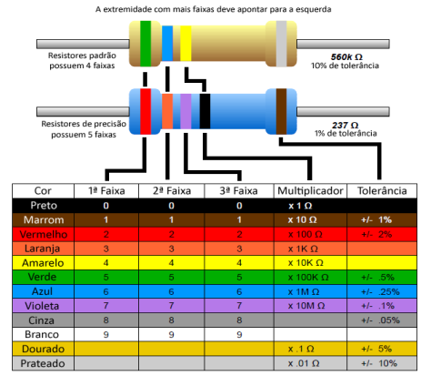

Para ler o resitor, usamos as 3 etapadas, identificar as faixas, o que cada uma representa e usar a fórmula.

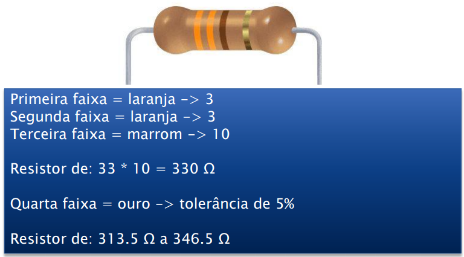

#### Associação de resistores em paralelo
Em um circuito elétrico os dois resistores associados em paralelo (1° Figura) têm o mesmo efeito de um único resistor equivalente de resistência RP (2° Figura).

Nesta imagem temos uma **Associação em Paralelo de Resistores**
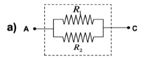

Nesta imagem temos uma **Associação em Paralelo de Resistores** que é equivalente à imagem anterior, pois a imagem anterior, tem o mesmo efeito de um resistor de equivalencia(RP).  
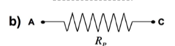

Na **associação em paralelo de resistores**, a ***soma da corrente*** *i1* passando por *R1* e *i2* por *R2* é a corrente total *i* passando pela associação: 

`i = i1 + i2`

As  voltagens  no  resistor  **R1** e  no  resistor  **R2** são  a  mesma  voltagem  da  associação *VAC*:

`V/RP = V/R1 +V/R2`

Dividindo tudo por **V**, para a **associação em paralelo de resistores** temos:

`1/RP = 1/R1 + 1/R2` ou `RP = (R1xR2) / (R1+R2)`

#### Potência Dissipada
Os **resistores** são dispositivos que podem  *transformar  a  energia elétrica  em calor por  meio  do efeito  ***Joule****.  Quando os  **elétrons**  passam  através  dos  resistores,  as  **colisões**  resultantes  dessas  partículas  com  a  **rede  cristalina**  do  material  que  compõe  o  resistor  ocasionam  um  aumento  da  sua  **agitação  térmica**, resultando em *transferências de calor para as vizinhanças do resistor*.

Por essa  razão,  os  resistores  são  largamente  empregados  em  *circuitos*  que  têm como intuito a **produção de calor**, como em ***aquecedores elétricos***, ***panelas elétricas***, ***fritadeiras elétricas***, ***ferros de passar roupa***, ***chuveiros elétricos***, etc.

Essa capacidade dos resistores  de  **produzir  energia  térmica**  está  diretamente  relacionada com a sua **resistência elétrica**.  

Essa propriedade  depende  do  *formato  do  corpo*,  da  *quantidade  de  elétrons  livres*  presentes  no  material  e  do  *tempo* e  *distância*  que  esses  elétrons  são  capazes  de  serem  conduzidos  ***sem  que  sofram  colisões  com  os  átomos  que  compõem o corpo***, entre outros. 

>"_Quanto maior for a **resistência** de um resistor, maior será a **quantidade de energia que ele dissipa** em forma de calor **a cada segundo**, em outras palavras, **maior será a potência por ele dissipada** (isso se refere à ***segunda Lei de Ohm***)._"

A  **grandeza  física**  que  mede  a  **quantidade  de  calor**  que  um  resistor  transfere  para os seus arredores **a cada segundo** é chamada de ***potência dissipada***. A potência dissipada é uma grandeza escalar medida em **Watts (W)**.

Para todos os efeitos, usaremos a seguinte expressão para o cálculo da Potência dissipada:

`P = V. I`

Observe  que  se  aplicarmos  a  Lei  de  Ohm  na  fórmula  acima  teremos  diversas  maneiras de calcularmos esta Potência:

`P = V2 / R` ou `P= R.I2`

Procure desenvolver os cálculos para essas novas fórmulas.

Leis de Ohm | Descrição | Fórmula
------------|-----------|------------
**1° Lei**  | A resistência(R) de um material condutor é definida pela razão entre a voltagem(V) aplicada aos seus terminais e pela corrente(i) passando por ele | `V = R * i` ou `i = V/R`
**2° Lei**  | Quanto maior for a resistência(R) de um resistor, maior será a quantidade de energia que ele dissipa em forma de calor a cada segundo, em outras palavras, maior será a potência(P) por ele dissipada | `P = V. I` ou `P = V2 / R` ou `P= R.I2`
**3° Lei**  | A corrente(i) que flui através de um fio condutor elétrico é diretamente proporcional à voltagem(V) e inversamente proporcional à resistência(R).
|

_Atividade Prática de Laboratório_: [Relatório 1:](RELAT%C3%93RIO%201/R1%20-%20EXERC%C3%8DCIOS%20RESOLVIDOS%3A%20NO%C3%87%C3%95ES%20B%C3%81SICAS%20DE%20CIRCUITOS%20EL%C3%89TRICOS%20SIMPLES.pdf) 

### Fontes de Alimentação DC
No geral como dito anteriormente, circuitos elétricos/eletrõnicos utilizam uma baixa tensão/voltagem para seu 
funcionamento, podendo variar entre 12V, 9V e 5V.

Na maioria dos projetos pequenos e de testes, usam-se fontes de 5V, porem isto não é uma regra. Podem servir como fontes:
- Geradores de Funções / Fontes de Energia

São caras e na maioria das vezes utilizada em empresas ou uso extremamente profissional.

- Construir sua prória Fonte de Alimentação

É possível fazer uma caseira, porém podem haver riscos de diferenças de valores e balanceamentos além de ser difícil conseguir certos componentes para montar uma.

- Usar Pilhas e/ou Baterias
  
São fáceis de se obter e utilizar, porém podem descarregar muito rapidamente e não recomendadas para uso prolongando e contínuo em projetos.

- Usar um carregador de celular com 5V é a opção mais viável, se necessário pode-se comprar um a parte, pois são fáceis de se obter ou pode-se usar o do próprio celular caso necessário.

- Caso a fonte de alimentação seja de 12V ou 9V, pode-se utilizar um **regulador de tensão 7805**. Ele recebe entrada de 7V à 28V e gera uma saída de 5V. Veja o circuito abaixo:

---

## TINKERCAD - SIMULADOR DE CIRCUITOS ELETRÔNICOS
TinkerCad é um simulador genérico, e que permite a simulação de circuitos eletrônicos. Possui vários componentes básicos para a montagem virtual e simulação de tais circuitos. Além disso, permite também simular circuitos controlados pelo Arduino,tanto em hardware quanto em software.

Para acessar o simulador acesse o [stie oficial do TnkerCad](https://www.tinkercad.com/).

Para conhecer mais sobre a ferramenta, o tutorial disponível pode auxiliar: [TUTORIAL TINKERCAD](https://www.makerzine.com.br/educacao/primeiros-passos-com-tinkercad-circuits-2-exemplos/)

Exemplos de Simulações que podem ser feitas pelo TINKERCAD.  

_Atividade Prática de Laboratório Utilizando o Simulador TinkerCad_

**EXEMPLO 1 - Circuito Simples**  

[Funcionamento do Projeto - EXEMPLO 1 - Circuito Simples](https://www.tinkercad.com/things/iyoHJvWWb0H?sharecode=6Tn5YeLvff7vNhM7a-Ro7l0Lgsg1TyenH3kZ-6Cbwgs)

**EXEMPLO 2: Circuito Com Arduino**  

[Funcionamento do Projeto - EXEMPLO 2: Circuito Com Arduino](https://www.tinkercad.com/things/7hX0AZhPwZK?sharecode=XBBV9AynS7ouJCJd39nROU5PO570DLC8tuEz1T_oCDU)

Documento com os projetos acima: [Relatório 2](RELAT%C3%93RIO%202/R2%20-%20EXERC%C3%8DCIOS%20RESOLVIDOS%3A%20INTRODU%C3%87%C3%83O%20AO%20TINKERCAD%20-%20SIMULADOR%20DE%20CIRCUITOS%20ELETR%C3%94NICOS.pdf)

---

## TRABALHANDO COM O TINKERCAD
### Protoboard
A protoboard possibilita a montagem, desenvolvimento e testes de diversos circuitos eletrônicos, sem realizar a solda dos componentes. Sendo assim, quando testamos como o circuito irá se comportar durante seu funcionamento, a protoboard é o lugar mais recomendado para montar este circuito e efetuar todos os testes necessários. Uma outra utilização muito comum é interligar sensores e circuitos integrados (CIs) aos diversos microcontroladores disponíveis como, por exemplo, o Arduino.

### ProtoBoard Física
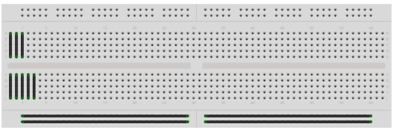
As partes pretas são ligações feitas por _Jumpers_(que representam ligações por fios).

### ProtoBoard Virtual do TINKERCAD
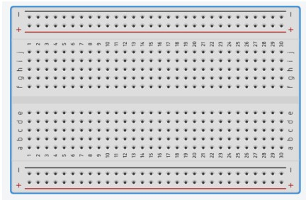

### Funcionamento da Protoboard
Abaixo temos as duas áreas disponíveis na protoboard. Na Figura **Área Protoboard A** a área para montagem de CIs e componentes (parte central do protoboard) em azul, a área para distribuição da alimentação elétrica (duas linhas superiores e inferiores) em vermelho. 

**Área Protoboard A**
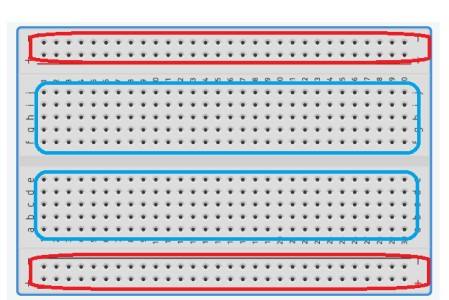

Na Figura **Área Protoboard B**, as linhas coloridas (em verde) representam as ligações internas da protoboard, ou seja, internamente elas já estão interligadas.  

**Área Protoboard B**
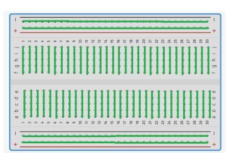

Com isso podemos observar que as linhas de alimentação estão separadas no meio, formando os barramentos de alimentação que permitem a utilização de diferentes fontes de energia. 

Apenas atente-se que esta separação está disponível apenas para os modelos de protoboards maiores (840 ou mais furos), para os modelos menores não existe esta separação. Observamos que as colunas formam agrupamentos de 5 em 5 furos, ou seja, assim que inserirmos um componente em um dos furos, ele estará eletricamente conectado a todos os outros furos daquela coluna.

Procure entender como são conectados os orifícios em um protoboard e consequentemente permitir a construção dos circuitos. 

#### Ligação Em Série e Ligação Em Paralelo
Agora será necessário você abrir o Tinkercad para executarmos os experimentos. Você poderá criar uma conta e ter acesso à ferramenta no link: [Tinkercad](https://www.tinkercad.com/)

**Circuito em Série e Paralelo na Protoboard**
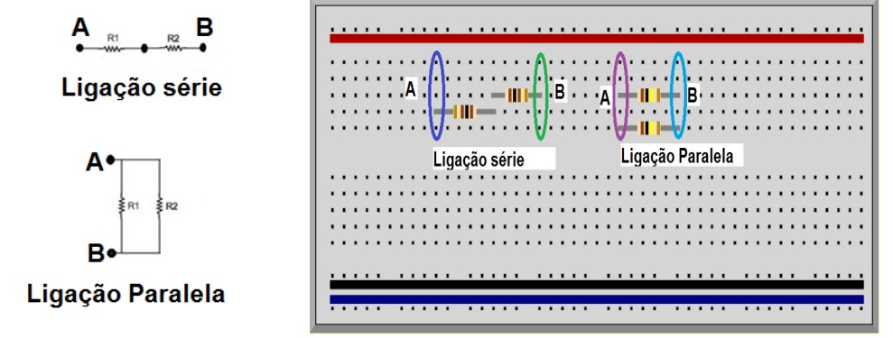

### O Multímetro
Multímetro é um equipamento utilizado para fazer a medição da _resistência elétrica_, _tensão_ ou _corrente contínua_ e da _tensão_ ou _corrente alternada_. Existem multímetros que também conseguem medir a **capacitância**, **temperatura**, **frequência de sinais alternados**, dentre outras _grandezas elétricas_.

Para estabelecer o tipo de medição que deve ser realizada com o Multímetro, basta acionar uma **chave rotativa** que existe neste aparelho e escolher a medição que deseja fazer.

O multímetro digital corresponde a um aparelho de **medição mais versátil**, que possui um _visor digital de cristal líquido_ e que é muito usado em _**laboratórios**_, **serviços de campo** ou na _**indústria**_. Esse aparelho engloba diferentes instrumentos de medição como o _**ohmímetro**_, o _**amperímetro**_ e o _**voltímetro**_.

Quando efetuar as medições fique atento aos _**valores máximos das escalas**_, pois se conectarmos a um circuito com _tensões_ ou _correntes_ **superiores** aos valores mostrados nas escalas escolhidas, podemos **_danificar permanentemente_** o aparelho.

**Descrição das Funções do Multímetro**
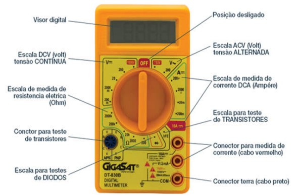

#### O Multímetro no simulador Tinkercad
No simulador Tinkercad existe um multímetro que pode ser inserido a um circuito. Ele implementa e mostra os mesmos resultados de um multímetro real.

**Multímetro do Tinkercad**
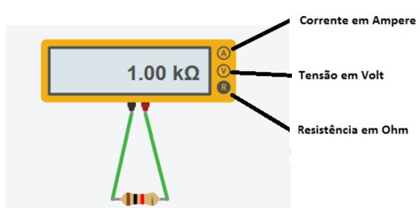

### Medições de Tensão (ou voltagem)

### Medições de Corrente

### Acionamento e cálculo de corrente com Leds

## DIVISOR DE TENSÃO

[Desafio: Um problema real:]() _Atividade Prática de Laboratório Utilizando o Simulador TinkerCad_

**DOCUMENTO** - [Relatório 3:]() _Atividade Prática de Laboratório Utilizando o Simulador TinkerCad_

---

## UTILIZANDO O TINKERCAD: SIMULANDO CIRCUITOS COM RELÉ
### Teoria de Funcionamento de um Relé
[Relatório 4:]() _Atividade Prática de Laboratório Utilizando o Simulador TinkerCad_

---

## ÁLGEBRA BOOLEANA E CIRCUITOS LÓGICOS 
INTRODUÇÃO AO SIMULADOR DE CIRCUITOS DIGITAIS LOGISIM

### Álgebra de Boole
### Tabela da Verdade
### Portas Lógicas
### Associações de Portas

### SIMULADOR DE CIRCUITOS DIGITAIS LOGISIM

[Relatório 5:]() _Atividade Prática de Laboratório Utilizando o Simulador LogiSim_

---

# Simplificação e Construção dos Circuitos

[Relatório 6:]() _Atividade Prática de Laboratório Utilizando o Simulador LogiSim_

## CIRCUITOS INTEGRADOS

### MONTAGENS DE CIRCUITOS INTEGRADOS

#### Parte 1
#### Parte 2

---

## INTRODUÇÃO AO ARDUINO

### Arduino

### SHIELDS

#### Arduino + SHIELDS

### Sensores

### Atuadores

### Projetando Circuitos Com Arduino

#### Montagem de Circuitos Elétricos Com Arduino

#### Ligando LEDs

### Linguagem de Programação do Arduino
#### Comandos Básicos da Linguagem do Arduino

[Projetos Com Arduino: Semáforo Simples]() - ***Descrever Atividade***

[Projetos Com Arduino: Semáforo Avançado]() - ***Descrever Atividade***

[Relatório 7:]() _Atividade Prática de Laboratório Utilizando o Arduino_

---

## TINKERCAD PARA SIMULAR CIRCUITOS COM O ARDUINO

### LED RGB
#### LED RGB - Entrada de Dados

[Projetos Com Arduino: Unindo Cores]() - ***Descrever Atividade***

## Botões 
### Botões  - Entrada de Dados
Capítulo 3 - Introdução ao Arduino - Prática II: Chave momentânea
(Push Button)

[Projetos Com Arduino: Ligando LEDs Com Botões]() - ***Descrever Atividade***

[Relatório 8:]() _Atividade Prática de Laboratório Utilizando o Arduino e o Simulador TinkerCad_

---

## Comunicação Serial no Arduino
### Comunicação Serial
#### Principais Funções:

[Projetos Com Arduino: Comunicação Serial Com IDE]() - ***Descrever Atividade***

[Projetos Com Arduino: Comunicação Serial Com TinkerCad]() - ***Descrever Atividade***

[Projetos Com Arduino: Comunicação Serial 0]() - ***Descrever Atividade***

[Projetos Com Arduino: Comunicação Serial 1]() - ***Descrever Atividade***

[Projetos Com Arduino: Comunicação Serial 2]() - ***Descrever Atividade***

[Projetos Com Arduino: Comunicação Serial 3]() - ***Descrever Atividade***

[Projetos Com Arduino: Comunicação Serial 4]() - ***Descrever Atividade***

## PWM
### Controlando Quantidade de Volts
#### Controle de Brilho do LED

[Projetos Com Arduino: Controle de Intensidade de Brilho do LED]() - ***Descrever Atividade***

[Relatório 9:]() _Atividade Prática de Laboratório Utilizando o Arduino e o Simulador TinkerCad_

---

## LDR
### Medir Luz

[Projetos Com Arduino: Circuito de Controle de Intensidade da Luz]() - ***Descrever Atividade***

[Projetos Com TinkerCad: Circuito de Controle de Intensidade da Luz]() - ***Descrever Atividade***

## BUZZER

[Projetos Com Arduino: Sirene]() - ***Descrever Atividade***

[Projetos Com TinkerCad: Sirene]() - ***Descrever Atividade***

[Relatório 10:]() _Atividade Prática de Laboratório Utilizando o Arduino e o Simulador TinkerCad_

---

## SENSOR ULTRASÔNICO
#### MEDINDO DISTÂNCIA ATRAVÉS DE SENSOR ULTRASÔNICO

### Ultrassom na Natureza

### Adaptações de Ultrassom Feitas Pelo Ser Humano

### Como Funciona um Ultrassom
#### Física Básica

### Funcionamento de um Sensor Ultrassônico

[Projetos Com Arduino: Medidor de Distância Ultrassônico]() - ***Descrever Atividade***

[Projetos Com TinkerCad: Medidor de Distância Ultrassônico]() - ***Descrever Atividade***

[Relatório 11:]() _Atividade Prática de Laboratório Utilizando o Arduino e o Simulador TinkerCad_

---

## MEDINDO TEMPERATURA
### Sensor de Temperatura

[Projetos Com Arduino: Circuito do Medidor de Temperatura]() - ***Descrever Atividade***

[Projetos Com TinkerCad: Circuito do Medidor de Temperatura]() - ***Descrever Atividade***

## MEDINDO UMIDADE DO SOLO
### Sensor de Umidade do Solo

[Projetos Com Arduino: Circuito do Medidor de Umidade do Solo]() - ***Descrever Atividade***

[Projetos Com TinkerCad: Circuito do Medidor de Umidade do Solo]() - ***Descrever Atividade***

[Projetos Com Arduino: Medidor de Umidade do Solo]() - ***Descrever Atividade***

[Projetos Com TinkerCad: Medidor de Umidade do Solo]() - ***Descrever Atividade***

## SERVO MOTORES

[Projetos Com TinkerCad: Circuito do Servo Motor]() - ***Descrever Atividade***

[Relatório 12:]() _Atividade Prática de Laboratório Utilizando o Arduino e o Simulador TinkerCad_

---

## Seminário IoT

---

## Trabalho Final do Curso Laboratório de Introdução À Engenharia de Computação

**Realizado Individualmente**
[Projetos Com Arduino: Simulando Um Computador]() - ***Descrever Atividade***

[Projetos Com TinkerCad: Simulando Um Computador]() - ***Descrever Atividade***

**Realizado Em Grupo**
[Projetos Com Arduino: Jogo da Memória]() - ***Descrever Atividade***

[Projetos Com TinkerCad: Jogo da Memória]() - ***Descrever Atividade***

---

# Tabela de Comandos - Linguagem Arduino

<table>
    <td>teste</td>
        <td>Comando</td>
        <td>Função</td>
        <td>Uso</td>
    <rt>teste</rt>
        <td>Comando</td>
        <td>Função</td>
        <td>Uso</td>
</table>