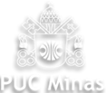

# Graduação em Engenharia da Computação

##  Pontifícia Universidade Católica

A Engenharia de Computação é uma graduação ofertada pela Pontifícia Universidade Católica, com abordagens diversas, abrangendo conteúdos das áreas de matemática, física, elétrica e eletrônica, além da computação (principalmente) e algumas disciplinas "extras" ofertadas como optativas.

Desde o 1° período, são apresentadas linguagens de programação, laboratórios de desenvolvimento de hardware, ensino de IA (Inteligência Artificial) e uma base matemática forte, com o intuito de desenvolver uma formação sólida, visando ao crescimento acadêmico e ao ingresso no mercado de trabalho atual.

---

### Disciplinas

Listadas em ordem alfabética, as disciplinas cursadas possuem seu próprio repositório com trabalhos, projetos, etc., desenvolvidos durante a graduação. O objetivo desses repositórios é facilitar o estudo futuro para revisões e/ou compartilhamento de informações.

Há também, abaixo da listagem, repositórios que envolvem projetos desenvolvidos durante eventos e/ou cursos ofertados pela PUC Minas, graças às diversas parcerias com grandes empresas do mercado atual. Até o momento, nem todos os repositórios foram organizados para divulgação, portanto, alguns ficarão indisponíveis para acesso. Disciplinas cursadas até agora:

* **Algoritmos e Estruturas de Dados I:** [Repositório: Algoritmos e Estruturas de Dados I](#)
* **Algoritmos e Estruturas de Dados II:** [Repositório: Algoritmos e Estruturas de Dados II](AEDS%20II/README.md)
* **Arquitetura de Computadores I:** [Repositório: Arquitetura de Computadores I](#)
* **Arquitetura de Computadores II:** [Repositório: Arquitetura de Computadores II](#)
* **Banco de Dados:** [Repositório: Banco de Dados](#)
* **Cálculo I:** [Repositório: Cálculo I](Calculo%20I/README.md)
* **Cálculo II:** [Repositório: Cálculo II](Calculo%20II/README.md)
* **Cidades Inteligentes (Optativa):** [Repositório: Cidades Inteligentes](#)
* **Desenvolvimento de Interfaces Web (Optativa):** [Repositório: Desenvolvimento de Interfaces Web](#)
* **Fundamentos de Física (Optativa):** [Repositório: Fundamentos de Física](#)
* **Game Design (Optativa):** [Repositório: Game Design](#)
* **Geometria Analítica e Álgebra Linear:** [Repositório: Geometria Analítica e Álgebra Linear](#)
* **Gestão de Redes e Mídias Sociais (Optativa):** [Repositório: Gestão de Redes e Mídias Sociais](#)
* **Internet das Coisas I:** [Repositório: Internet das Coisas I](#)
* **Introdução à Computação:** [Repositório: Introdução à Computação](#)
* **Introdução aos Sistemas Inteligentes:** [Repositório: Introdução aos Sistemas Inteligentes](#)
* **Laboratório de Introdução à Engenharia de Computação:** [Repositório: Laboratório de Introdução à Engenharia de Computação](#)
* **Matemática Financeira (Optativa):** [Repositório: Matemática Financeira](#)
* **[Nome da Disciplina]**: [Link para o README da disciplina]

### Outros Repositórios

**Eventos na Instituição:**

* [Mouser Roadshow 2022](#)
* [Mouser Roadshow 2023](#)

**Projetos de Pesquisa e Iniciação Científica:**

* Projeto de Pesquisa com o curso de Engenharia Aeronáutica: [Repositório: ORBI Engineering](#)
* Projeto de Pesquisa e Iniciação Científica na Engenharia de Computação: [Repositório: Robótica Aplicada na Saúde](#)

---

* [Link para o repositório dos seus projetos pessoais]
* [Link para o repositório de seus projetos de iniciação científica]

---

Estrutura do README

Título e Imagem de capa;
Badges;
Índice;
Descrição do Projeto;
Status do Projeto;
Funcionalidades e Demonstração da Aplicação;
Acesso ao Projeto;
Tecnologias utilizadas;
Pessoas Contribuidoras;
Pessoas Desenvolvedoras do Projeto;
Licença.

https://www.canva.com/
https://emojipedia.org/search/?q=bag
https://dev.to/envoy_/150-badges-for-github-pnk

Legenda Emoji:
⌛: Ainda não Realizada
✅: Aula Realizada

Prompt de correção textual: Faça uma correção de todo o texto escrito no README.md enviado abaixo. Corrija qualquer erro ortográfico, gramatical, coesão textual e tudo relacionado a correção de texto.
