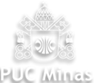

# 🎓 Portifólio da Graduação em Engenharia de Computação 👨‍🎓

## 🏫 Pontifícia Universidade Católica de Minas Gerais 

### 📍 Unidade Frequentadas: São Gabriel (_PSG_), Praça da Liberdade (_PPL_) e Coração Eucarístico (_PCE_)

<!-- 

 -->

A Engenharia de Computação é uma graduação ofertada pela Pontifícia Universidade Católica, com abordagens diversas, abrangendo conteúdos das áreas de matemática, física, elétrica e eletrônica, além da computação (principalmente) e algumas disciplinas "extras" ofertadas como optativas.

Desde o 1° período, são apresentadas linguagens de programação, laboratórios de desenvolvimento de hardware, ensino de IA (Inteligência Artificial) e uma base matemática forte, com o intuito de desenvolver uma formação sólida, visando ao crescimento acadêmico e ao ingresso no mercado de trabalho atual.

---

### Disciplinas

Listadas em ordem alfabética, as disciplinas cursadas possuem seu próprio repositório com trabalhos, projetos, etc., desenvolvidos durante a graduação. O objetivo desses repositórios é facilitar o estudo futuro para revisões e/ou compartilhamento de informações.

> Até o momento, nem todos os repositórios foram organizados para divulgação, portanto, alguns ficarão indisponíveis para acesso.

---
Legenda Emoji:  
⌛: Ainda não Concluída
✅: Disciplina Concluída

---

- [x] **Algoritmos e Estruturas de Dados I**: [Repositório: Algoritmos e Estruturas de Dados I](#)  
      Representação e armazenamento de dados. Manipulação e movimentação de dados em memória principal e secundária. Abstração de dados. Estruturas e abstração de controle. Modularização, encapsulamento e herança. Recursividade. Documentação e testes. Implementação em linguagem de programação. Contagem de operações.  
- **Algoritmos e Estruturas de Dados II**: [Repositório: Algoritmos e Estruturas de Dados II](#)
  Somatórios. Fundamentos de análise de algoritmos. Ordenação e pesquisa em memória principal. Tipos abstratos de dados lineares e flexíveis. Árvores. Balanceamento de árvores. Tabelas e Dicionários.
- **Algoritmos e Estruturas de Dados III**: [Repositório: Algoritmos e Estruturas de Dados III](#)  
- **Algoritmos em Grafos**: [Repositório: Algoritmos em Grafos](#)  
- [x] **Arquitetura de Computadores I**: [Repositório: Arquitetura de Computadores I](#)  
      Processadores. Modelos para representação de dados e aritmética computacional em nível de máquina. Funções lógicas: modelamento e algoritmos para minimização. Descrição e síntese de elementos combinacionais. Descrição e síntese de elementos lógicos sequenciais e máquinas de estado. Unidades funcionais básicas de computadores e introdução ao software básico. Linguagens e ferramentas para projeto e descrição de hardware.
- [x] **Arquitetura de Computadores II**: [Repositório: Arquitetura de Computadores II](#)  
      Aritmética computacional avançada. Análise de desempenho e complexidade de arquiteturas. Organização de computadores: memória, unidade central de processamento, entrada e saída. Geração de programas nativos. Linguagens de montagem. Modos de endereçamento, conjunto de instruções. Manipulação de pilhas. Sub-rotinas: tipos, características e passagem de parâmetros. Mecanismos de interrupção e de exceção. Introdução a microcontroladores e microprocessadores. Introdução à síntese de alto nível (HLS) para hardware. Introdução a linguagens de descrição de hardware (HDL). Análise de algoritmos para arquitetura de computadores. 
- [x] **Arquitetura de Computadores III**: [Repositório: Arquitetura de Computadores III](#)  
- [x] **Banco de Dados**: [Repositório: Banco de Dados](#)  
      Conceitos de gerenciamento de bancos de dados. Arquitetura de um SGBD. Modelos de dados. Modelo de bancos de dados. Linguagens de definição, manipulação e controle de dados. Normalização e projeto físico de bancos de dados. Aspectos de segurança em banco de dados. 
- [x] **Cálculo I**: [Repositório: Cálculo I](#)  
      Funções: polinomiais, racionais, algébricas, exponenciais, logarítmicas, trigonométricas. Limites. Continuidade. Derivada: definição e interpretações. Regras de derivação. Derivação implícita. Aplicações da derivada: taxas relacionadas, regra de L'Hospital, estudo do comportamento de funções, esboço de gráficos e otimização. Aplicações práticas.
- [x] **Cálculo II**: [Repositório: Cálculo II](#)  
      Integral indefinida. Técnicas de integração: substituição, por partes, trigonométricas, substituição trigonométrica e frações parciais. Integral definida: conceitos e Teorema Fundamental do Cálculo. Superfícies. Funções de várias variáveis. Derivadas parciais. Aproximações lineares. Regra da cadeia. Derivadas direcionais e vetor gradiente. Valores máximos e mínimos. Aplicações práticas. 
- **Cálculo III**: [Repositório: Cálculo III](#)
  Integrais duplas em coordenadas retangulares e polares. Integrais triplas em coordenadas retangulares, cilíndricas e esféricas. Aplicações de integrais duplas e triplas nas Ciências Exatas e Engenharias. Equações Diferenciais: terminologia e conceitos fundamentais em modelagem matemática. Equações separáveis e exatas. Transformada de Laplace. Resolução de equações diferenciais de primeira e segunda ordem. Modelagem matemática e aplicações de equações diferenciais nas Ciências Exatas e Engenharias.
- [x] **Cidades Inteligentes (Optativa)**: [Repositório: Cidades Inteligentes](#)  
- [x] **Ciências do Ambiente**: [Repositório: Ciências do Ambiente](#)  
- **Compiladores**: [Repositório: Compiladores](#)  
- **Computação Distribuída**: [Repositório: Computação Distribuída](#)  
- **Computação Gráfica (Optativa)**: [Repositório: Computação Gráfica](#)  
- **Computadores e Sociedade**: [Repositório: Computadores e Sociedade](#)  
- [x] **Desenvolvimento de Interfaces Web (Optativa)**: [Repositório: Desenvolvimento de Interfaces Web](#)  
- **Eletrônica para Computação**: [Repositório: Eletrônica para Computação](#)  
- **Empreendedorismo e Inovação (Optativa)**: [Repositório: Empreendedorismo e Inovação](#)  
- **Engenharia de Software (Optativa)**: [Repositório: Engenharia de Software](#)  
- **Estatística e Probabilidade**: [Repositório: Estatística e Probabilidade](#)
  Estatística descritiva. Probabilidade. Variáveis aleatórias. Distribuições discretas. Distribuições contínuas. Inferência estatística: estimação, intervalos de confiança e testes de hipóteses. Regressão linear.  
- **Estágio Obrigatório**: [Repositório: Estágio Obrigatório](#)  
- [x] **Filosofia: Antropologia e Ética**: [Repositório: Filosofia: Antropologia e Ética](#)  
- [x] **Filosofia: Razão e Modernidade**: [Repositório: Filosofia: Razão e Modernidade](#)  
- [x] **Fundamentos de Física (Optativa)**: [Repositório: Fundamentos de Física](#)  
- **Fundamentos de Geoprocessamento (Optativa)**: [Repositório: Fundamentos de Geoprocessamento](#)  
- **Fundamentos de Mecânica**: [Repositório: Fundamentos de Mecânica](#)  
- **Fundamentos Teóricos da Computação**: [Repositório: Fundamentos Teóricos da Computação](#)  
- [x] **Game Design (Optativa)**: [Repositório: Game Design](#)  
- **Geometria Analítica e Álgebra Linear**: [Repositório: Geometria Analítica e Álgebra Linear](#)  
  Sistemas de coordenadas no plano e no espaço. Lugares geométricos e seções cônicas. Tratamento algébrico e geométrico dos vetores no plano e no espaço. Produtos escalar, vetorial e misto. Matrizes, determinantes e sistemas lineares. Espaços vetoriais. Base. Transformações lineares. Autovalores e Autovetores. Modelagem matemática e aplicações práticas.  
- [x] **Gerência de Projeto de Software**: [Repositório: Gerência de Projeto de Software](#)  
- [x] **Gestão de Redes e Mídias Sociais (Optativa)**: [Repositório: Gestão de Redes e Mídias Sociais](#)  
- **História e Cultura Afrobrasileira e Indígena (Optativa)**: [Repositório: História e Cultura Afrobrasileira e Indígena](#)  
- [x] **Internet das Coisas I**: [Repositório: Internet das Coisas I](#)
      Conceitos fundamentais de Internet das Coisas. Arquiteturas e protocolos de comunicação IoT. Redes sem fio para IoT. Sensores, atuadores e integração com sistemas IoT. Plataformas de desenvolvimento e armazenamento em nuvem para IoT. Segurança em aplicações IoT. Experimentação e implementação prática de sistemas IoT.
- **Internet das Coisas II**: [Repositório: Internet das Coisas II](#)  
- [x] **Introdução à Computação**: [Repositório: Introdução à Computação](#)  
      História da computação e principais linguagens de programação. Banco de dados. Representação de dados, sistemas de numeração, álgebra booleana, portas lógicas e circuitos combinacionais. Iniciação à Ciência de Dados e Inteligência Artificial, Sistemas Computacionais, Sistemas de Informação, Engenharia de Software e Jogos Digitais. Computação Verde. Tendências tecnológicas emergentes. 
- [x] **Introdução aos Sistemas Inteligentes**: [Repositório: Introdução aos Sistemas Inteligentes](#)  
- [x] **Laboratório de Introdução à Engenharia de Computação**: [Repositório: Laboratório de Introdução à Engenharia de Computação](#)  
- [x] **Laboratório de Desenvolvimento para Dispositivos Móveis**: [Repositório: Laboratório de Desenvolvimento para Dispositivos Móveis](#)  
- **Laboratório de Física**: [Repositório: Laboratório de Física](#)  
- **Leitura de Textos em Língua Inglesa (Optativa)**: [Repositório: Leitura de Textos em Língua Inglesa](#)  
- **Língua Brasileira de Sinais (Optativa)**: [Repositório: Língua Brasileira de Sinais](#)  
- **Linguagens de Programação**: [Repositório: Linguagens de Programação](#)  
- **Marketing de Serviços, Produtos e Preços (Optativa)**: [Repositório: Marketing de Serviços, Produtos e Preços](#)  
- [x] **Matemática Financeira (Optativa)**: [Repositório: Matemática Financeira](#)  
- **Modelagem e Avaliação de Desempenho**: [Repositório: Modelagem e Avaliação de Desempenho](#)  
- **Negociação e Tomada de Decisão (Optativa)**: [Repositório: Negociação e Tomada de Decisão](#)  
- **Otimização de Sistemas**: [Repositório: Otimização de Sistemas](#)  
- **Processamento e Análise de Imagens**: [Repositório: Processamento e Análise de Imagens](#)  
- **Produção de Textos Acadêmicos (Optativa)**: [Repositório: Produção de Textos Acadêmicos](#)  
- **Produção de Vídeo Mobile (Optativa)**: [Repositório: Produção de Vídeo Mobile](#)  
- **Projeto e Análise de Algoritmos**: [Repositório: Projeto e Análise de Algoritmos](#)  
- **Projeto Integrado de Software e Hardware**: [Repositório: Projeto Integrado de Software e Hardware](#)  
- **Redes de Computadores I**: [Repositório: Redes de Computadores I](#)  
- **Redes de Computadores II**: [Repositório: Redes de Computadores II](#)  
- **Sistemas de Automação Industrial**: [Repositório: Sistemas de Automação Industrial](#)  
- **Sistemas Dinâmicos e Controle de Processos**: [Repositório: Sistemas Dinâmicos e Controle de Processos](#)  
- **Sistemas Embarcados**: [Repositório: Sistemas Embarcados](#)  
- **Sistemas Inteligentes de Software e Hardware**: [Repositório: Sistemas Inteligentes de Software e Hardware](#)  
- **Sistemas Operacionais**: [Repositório: Sistemas Operacionais](#)  
- [x] **Sistemas Reconfiguráveis**: [Repositório: Sistemas Reconfiguráveis](sistemas-reconfiguraveis/README.md)  
- ⌛ **Teoria de Circuitos Elétricos**: [Repositório: Teoria de Circuitos Elétricos](tce/README.md)  
- **Tópicos em Computação I**: [Repositório: Tópicos em Computação I](#)  
- **Tópicos em Computação II**: [Repositório: Tópicos em Computação II](#)  
- **Tópicos em Computação III**: [Repositório: Tópicos em Computação III](#)  
- **Tópicos em Sistemas de Informação**: [Repositório: Tópicos em Sistemas de Informação](#)  
- **Trabalho de Conclusão de Curso I**: [Repositório: Trabalho de Conclusão de Curso I](#)  
- **Trabalho de Conclusão de Curso II**: [Repositório: Trabalho de Conclusão de Curso II](#)  
- **Trabalho de Diplomação II**: [Repositório: Trabalho de Diplomação II](#)  
- **Cultura Religiosa: Fenômeno Religioso**: [Repositório: Cultura Religiosa: Fenômeno Religioso](#)  
- **Cultura Religiosa: Pessoa e Sociedade**: [Repositório: Cultura Religiosa: Pessoa e Sociedade](#)

---

### Outros Repositórios

Há também repositórios que envolvem projetos desenvolvidos durante eventos e/ou cursos ofertados pela PUC Minas, graças às diversas parcerias com grandes empresas do mercado atual, projetos de pesquisa, extensão e iniciação científica.

> Até o momento, nem todos os repositórios foram organizados para divulgação, portanto, alguns ficarão indisponíveis para acesso.

**Eventos na Instituição**:

* [Mouser Roadshow 2022](#)
* [Mouser Roadshow 2023](#)
* [Hackatruck 2023](#)
* [Hackatruck 2025](#)
* [Maratona Levity](#)

**Projetos de Pesquisa e Iniciação Científica**:

* Projeto de Pesquisa com o curso de Engenharia Aeronáutica: [Repositório: ORBI Engineering](#)
* Projeto de Pesquisa e Iniciação Científica na Engenharia de Computação: [Repositório: Robótica Aplicada na Saúde](#)

---

**Projetos de Extensão**:
* Projeto Beira Linha: [Repositório: Projeto Beira Linha](#)
* Projeto Imersão Tec: [Repositório: Projeto Imersão Tec](#)

---

**Projetos Desenvolvidos em Disciplinas**:
* Projeto Clone do Genius: [Repositório: Projeto Clone do Genius](#)
* Projeto Relógio Digital: [Repositório: Projeto Relógio Digital](#)
* Projeto Clone do Geogebra: [Repositório: Projeto Clone do Geogebra](#)
* Projeto Soma de Riemman: [Repositório: Projeto Clone do Geogebra](#)
* Projeto Estação Meteorológica: [Repositório: Projeto Estação Meteorológica](#)
* Projeto Hierarquia de Memória: [Repositório: Projeto Hierarquia de Memória](#)
* Projeto Lifely: [Repositório: Projeto Lifely](#)
* Projeto Microprocessador PUC-252: [Repositório: Projeto Microprocessador PUC_252](#)

---

* [Link para o repositório dos seus projetos pessoais](#)
* [Link para o repositório de seus projetos de iniciação científica](#)

---

Estrutura do README

Título e Imagem de capa;
Badges;
Índice;
Descrição do Projeto;
Status do Projeto;
Funcionalidades e Demonstração da Aplicação;
Acesso ao Projeto;
Tecnologias utilizadas;
Pessoas Contribuidoras;
Pessoas Desenvolvedoras do Projeto;
Licença.

https://www.canva.com/
https://emojipedia.org/search/?q=bag
https://dev.to/envoy_/150-badges-for-github-pnk

Legenda Emoji:
⌛: Ainda não Realizada
✅: Aula Realizada

Prompt de correção textual: Faça uma correção de todo o texto escrito no README.md enviado abaixo. Corrija qualquer erro ortográfico, gramatical, coesão textual e tudo relacionado a correção de texto.
